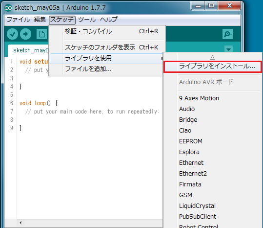
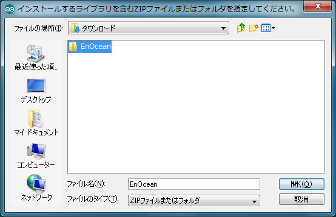
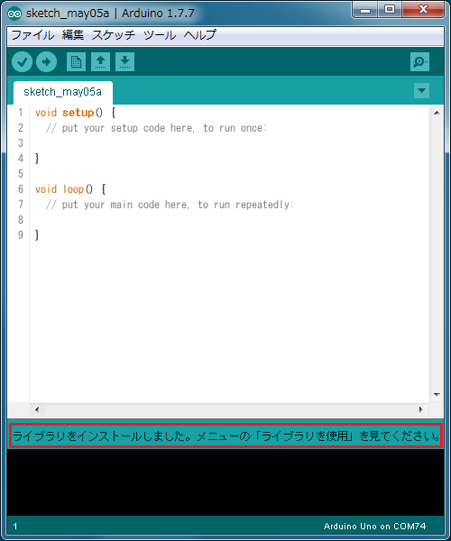

EnOcean Library for Arduino
====

「EnOcean Library for Arduino」は、EnOcean Serial Protocol 3 (ESP3)のParserをArduino向けにライブラリ化したものです。 
SiMICS製のEnOcean Shield (TCM410J)を使って、EnOceanの無線通信データを容易に取得することができます。

## Description
本ライブラリは、Arduinoのdigital pin 0 (RX)で受信したESP3を解析し、設定したコールバック関数の引数としてR-ORG, Originator ID, Data(Payload)を取得することができます。 
以下のEnOceanプロトコルに対応しています。

* ESP3 Packet Type 10: RADIO_ERP2
* EEP: RPS, 1BS, 4BS 
※CRC8のチェックは省いています 
※Repeater経由のデータには対応していません

## Demo

### サンプルプログラム: SimpleDisplay
EnOcean Shield (TCM410J)で受信した無線データを、シリアルモニタ上へ表示します

## VS. DolphinView

* SimpleDisplayは、DolphinViewのシンプル機能版です
* DolphinViewはWindowsで使用するのに対して、SimpleDisplayはArduino環境で使用します

## Requirement

* Arduino IDE 1.7.2以降のバージョンを使用してください

## Usage

### サンプルプログラム: SimpleDisplay

 ※あらかじめ、下記Installを済ませておいてください

1. Arduino IDEのメニューバーから「ファイル->スケッチの例->EnOcean->SimpleDisplay」を選択します 

※スケッチをマイコンボードに書き込むときは、EnOcean ShieldのSW3を「Prog」側にしてください。通常はSW3を「Normal」側にしてください。

## Install

1. [GitHub repository](https://github.com/simics-co/EnOcean)から[EnOcean-master.zip](https://github.com/simics-co/EnOcean/archive/master.zip)をダウンロードします
2. 圧縮ファイルを展開し、フォルダ名を「EnOcean」へ変更します
3. Arduino IDEのメニューバーから「スケッチ->ライブラリを使用->ライブラリをインストール...」を選択します 

4. インストールするフォルダ「EnOcean」を選択します 
 

5. インストールしたライブラリとArduinoの既存ライブラリが競合するため、 
[Arduinoインストールフォルダ]\hardware\arduino\avr\cores\arduino\HardwareSerial0.cpp
内の「ISR(USART\_RX\_vect)」をコメントアウトします 
※本ライブラリでは、受信データの取りこぼしを回避するため、USART受信完了割り込み処理：ISR(USART\_RX\_vect)を追加しています

コメントアウト例：

    #if 0  // Add
    #if defined(USART_RX_vect)
      ISR(USART\_RX\_vect)
    #elif defined(USART0_RX_vect)
      ISR(USART0_RX_vect)
    #elif defined(USART_RXC_vect)
      ISR(USART_RXC_vect) // ATmega8
    #else
      #error "Don't know what the Data Received vector is called for Serial"
    #endif
      {
        Serial._rx_complete_irq();
      }
    #endif  // Add

## Contribution

1. Forkする ( https://github.com/simics-co/EnOcean#fork-destination-box )
2. ローカル上でbranchを作る (git checkout -b my-new-feature)
3. 変更した内容をcommitする (git commit -am 'Add some feature')
4. pushする (git push origin my-new-feature)
5. Pull Requestを作成する

## Licence

   Copyright 2016 LoonaiFactory

   Licensed under the Apache License, Version 2.0 (the "License");
   you may not use this file except in compliance with the License.
   You may obtain a copy of the License at

       http://www.apache.org/licenses/LICENSE-2.0

   Unless required by applicable law or agreed to in writing, software
   distributed under the License is distributed on an "AS IS" BASIS,
   WITHOUT WARRANTIES OR CONDITIONS OF ANY KIND, either express or implied.
   See the License for the specific language governing permissions and
   limitations under the License.

## Author

[LoonaiFactory](https://github.com/loonaifactory)
